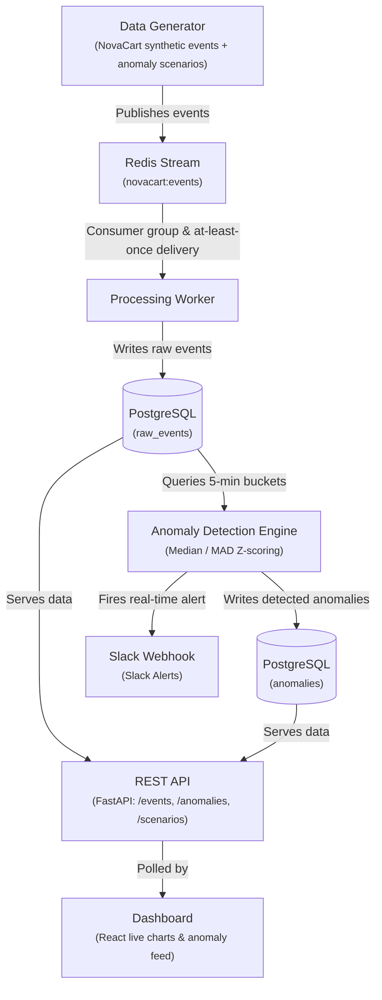

# Real-Time BI & Anomaly Detection Platform

A real-time business intelligence platform that simulates a mid-size
e-commerce business, streams its activity through a real event pipeline,
and automatically detects anomalies — a sales drop, a traffic spike, a
payment gateway failure — using statistical methods, surfacing them on a
live dashboard and via Slack alerts.

Built as a deliberate technical counterpart to a prior CRUD/AI-search
project: this one focuses on Python, data engineering, event-driven
architecture, and statistics rather than REST CRUD + vector search.

## Status

✅ **Phase 2 (MVP) complete** — fully working, containerized, end-to-end
pipeline. See [docs/roadmap.md](docs/roadmap.md) for the full history and
what's next (Phase 3, ML-based detection).

## What it does

NovaCart, the fictional business at the center of this project, generates
realistic synthetic activity — orders, revenue, site traffic, signups,
inventory levels, and payment attempts/failures — across three product
categories, with real daily/weekly seasonality and gradual growth. Five
named incident scenarios can be triggered live, on demand, via a single
API call:

| Scenario | What it simulates |
|---|---|
| `revenue_drop` | Orders (and the revenue that follows) crash in one category |
| `traffic_spike` | Site-wide traffic surges suddenly (viral moment, bot activity) |
| `payment_failure` | Payment failure rate spikes while traffic/orders look normal — a checkout problem, not a demand problem |
| `inventory_problems` | Inventory drops faster than sales explain (shrinkage/miscount) |
| `normal` | No incident — baseline activity only |

The detection engine catches these automatically, using a
**median/MAD ("modified z-score")** approach — chosen deliberately over
plain mean/stddev after real testing exposed a concrete failure mode:
a short anomaly sitting inside the statistical baseline's own lookback
window can contaminate a mean/stddev baseline enough to mask itself.
Median/MAD is robust to that minority-outlier contamination. See
[docs/roadmap.md](docs/roadmap.md) for the full story.

## Architecture

Runs as 6 coordinated Docker containers: `postgres`, `redis`, `app`
(producer), `worker` (consumer), `detector`, `api`, `dashboard`.

## Tech stack

| Layer | Choice |
|---|---|
| Language | Python 3.12 (generator, ingestion, processing, detection, API) |
| Streaming | Redis Streams (consumer groups, at-least-once delivery) |
| Database | PostgreSQL |
| API | FastAPI |
| Frontend | React + Vite + Recharts |
| Detection | Statistical (median/MAD z-score) — see roadmap for planned ML layer |
| Alerting | Slack incoming webhooks |
| Infra | Docker Compose (6 services) |

## Repo layout

| Folder | Purpose |
|---|---|
| `generator/` | NovaCart synthetic event generator; `scenarios/` holds named, reusable incidents on top of the anomaly injection engine (`anomalies.py`) |
| `ingestion/` | Producer — publishes generated events to Redis, polls for live scenario triggers |
| `processing/` | Consumer — reads the Redis stream, persists to Postgres |
| `detection/` | Statistical anomaly detection engine + Slack alerting |
| `api/` | FastAPI service — events, anomalies, scenario listing/triggering |
| `dashboard/` | React frontend — live chart with anomaly overlays, live feed |
| `infra/` | Docker Compose, Dockerfiles, schema + migrations |
| `docs/` | Business definition, roadmap, running-locally guide |
| `tests/` | pytest suites (generator, anomalies, detection rules) |

## Getting started

See [docs/running-locally.md](docs/running-locally.md) for startup,
simulation-speed tuning, resetting the database, and triggering a
scenario live.

## Roadmap

See [docs/roadmap.md](docs/roadmap.md) for the full Day 1 → MVP → Advanced
plan, including what's built, what was deliberately skipped (AWS
deployment, for cost), and what Phase 3 would add.